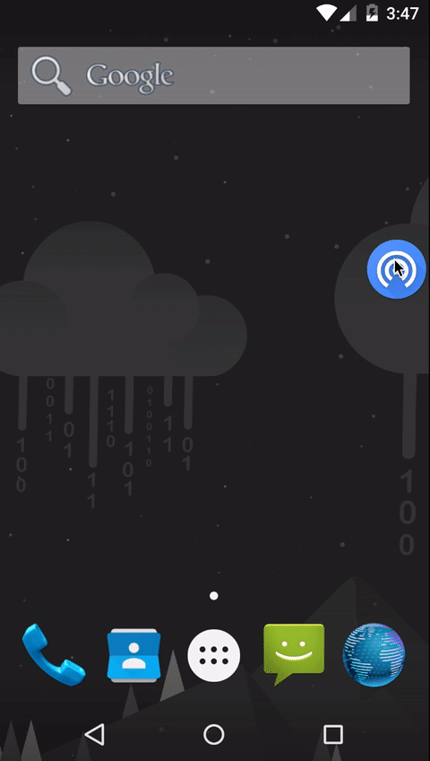

# Floating Bubble Library
Simple library for adding a floating bubble in your application!

## Installation
```java
repositories {
    ...
    maven {
        url "http://dl.bintray.com/bijoysingh693/maven"
    }
    ...
}
```

```java
compile 'com.github.bijoysingh.floating-bubble:1.0.2'
```

## Demos


## Usage

### Setup
Let's start with a simple setup for the Service
```java
public class FloatingService extends FloatingBubbleService {
    ...
}
```

Adding your library in the manifest
```java
<service android:name="<YOUR_PACKAGE>.FloatingService" />
```

Start the service
```java
startService(new Intent(context, FloatingService.class));
```

### Customising the Service
```java
public class FloatingService extends FloatingBubbleService {

  @Override
  protected FloatingBubbleConfig getConfig() {
    return new FloatingBubbleConfig.Builder()
        // Set the drawable for the bubble
        .bubbleIcon(bubbleDrawable)

        // Set the drawable for the remove bubble
        .removeBubbleIcon(removeIconDrawable)

        // Set the size of the bubble in dp
        .bubbleIconDp(64)

        // Set the size of the remove bubble in dp
        .removeBubbleIconDp(64)

        // Set the padding of the view from the boundary
        .paddingDp(4)

        // Set the radius of the border of the expandable view
        .borderRadiusDp(4)

        // Does the bubble attract towards the walls
        .physicsEnabled(true)

        // The color of background of the layout
        .expandableColor(Color.WHITE)

        // The color of the triangular layout
        .triangleColor(Color.WHITE)

        // Horizontal gravity of the bubble when expanded
        .gravity(Gravity.END)

        // The view which is visible in the expanded view
        .expandableView(yourViewAfterClick)

        // Building
        .build();
  }
}
```

Override the onGetIntent function. It will return true if the intent is valid, else false
```java
  @Override
  protected boolean onGetIntent(@NonNull Intent intent) {
    // your logic to get information from the intent
    return true;
  }
```

## License
```java
Copyright 2016 Bijoy Singh Kochar

Licensed under the Apache License, Version 2.0 (the "License");
you may not use this file except in compliance with the License.
You may obtain a copy of the License at

   http://www.apache.org/licenses/LICENSE-2.0

Unless required by applicable law or agreed to in writing, software
distributed under the License is distributed on an "AS IS" BASIS,
WITHOUT WARRANTIES OR CONDITIONS OF ANY KIND, either express or implied.
See the License for the specific language governing permissions and
limitations under the License.
```